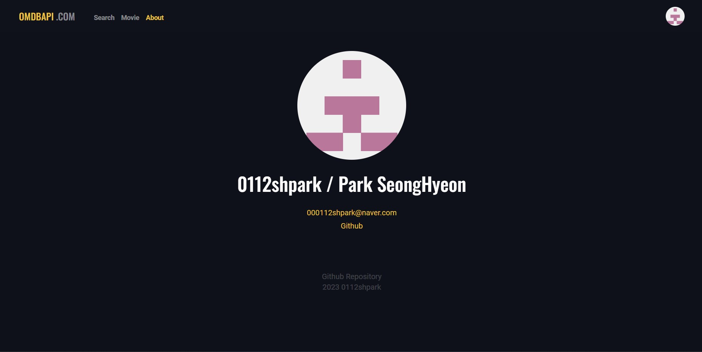
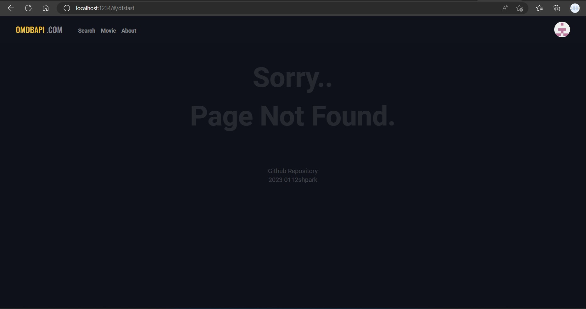

# 🎥 OMDb API Movie APP

<div align="center">

</div>

---

# :bell: Visit the site

➡️[Movie site](https://om-db-movie-app.vercel.app/#/)

## 🧐 About

Movie searching website with OMDb API.

## 💡Features

- Provide Movie searching using OMDb API.
- Header and footer components.
- Use footer to visit my Github repository.
- `View more` button to show more results.
- `About` page.
<div align="center">

</div>

- `Page Not Found` error page when user access wrong page.
<div align="center">

</div>

## ⛏️Built with

- 
- 
- 
- 

## 📑 Initial Settings

<h3>🔥Reset-CSS</h3>

---

Reset the Browser's CSS style for Cross Browsing.

```html
<link
  rel="stylesheet"
  href="https://cdn.jsdelivr.net/npm/reset-css@5.0.1/reset.min.css"
/>
```

<h3>🔥Google Fonts and Material Icons</h3>

---

⭐ Following Fonts are used in this project.

- `Roboto`: Regular 400, bold 700.
- `Oswald`: Medium 500.

```html
<link rel="preconnect" href="https://fonts.googleapis.com" />
<link rel="preconnect" href="https://fonts.gstatic.com" crossorigin />
<link
  href="https://fonts.googleapis.com/css2?family=Oswald:wght@500&family=Roboto:wght@400;700&display=swap"
  rel="stylesheet"
/>
```

## 🏃Getting Started

### 📌 Start at local device

- This project works on the device with `node.js` installesd.

1. Clone this repository.
   - `git clone https://github.com/0112shpark/OMDb-movie-app.git`
2. Move directory into the folder `OMDb-movie-app`
   - `cd OMDb-movie-app`
3. Install `parcel bundler`.
   - `npm i -D parcel `
4. Install `vercel bundler`.(only if API set succeed)
   - `npm i -D vercel `
5. Run developing server with following command.
   - `npm run dev`
6. Visit the site with domain name `localhost/####`.

## 🔑 API key Issue

⚠️ API KEY is a sensitive information when we try to access server. API key should be protected and not be shown to users.

I tried to hide API key, but `handler function` in `api` folder gives me a `502 bad gateway error`.  
Can't figure out solutions..

- Solution: My project path includes `space`, and terminal can not read `space`. To solve, move the directory to the path without and `space`.
